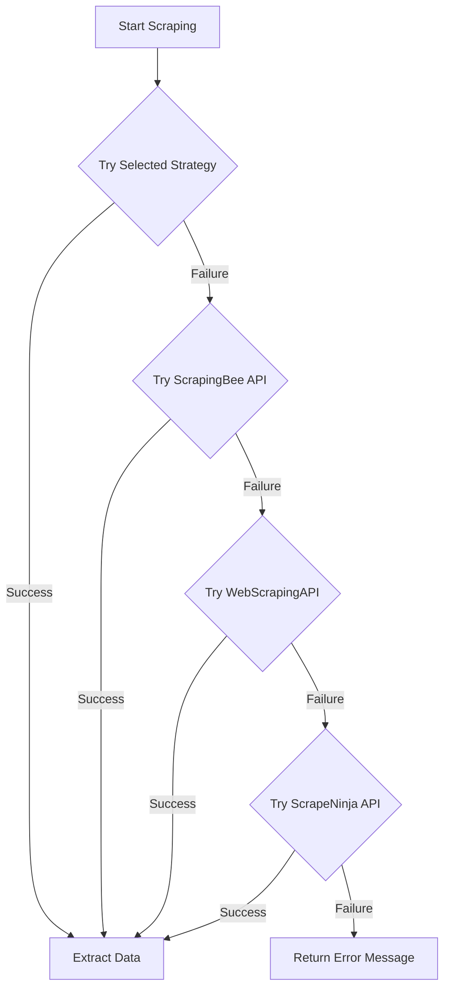

# 🕸️ Advanced Web Scraping AI Agent

<div align="center">


**A sophisticated web scraping solution with AI-powered strategy selection**

[Features](#key-features) • 
[Demo](#live-demo) • 
[Installation](#installation) • 
[Usage](#usage) • 
[Architecture](#architecture) • 
[API Keys](#api-keys) • 
[Contributing](#contributing)

</div>

<p align="center">
  
</p>

## 🌟 Overview

The **Advanced Web Scraping AI Agent** is a cutting-edge tool that revolutionizes web data extraction by intelligently selecting the optimal scraping strategy based on website complexity. Deployed on Hugging Face Spaces, this agent combines multiple scraping techniques with a sleek, professional UI to deliver a powerful yet user-friendly experience.

## 🚀 Key Features

<table>
  <tr>
    <td width="50%">
      <h3>🧠 Intelligent Strategy Selection</h3>
      <p>Automatically analyzes websites and selects the optimal scraping method:</p>
      <ul>
        <li>BeautifulSoup for static websites</li>
        <li>Selenium/Pyppeteer for dynamic content</li>
        <li>Scrapy for structured data extraction</li>
        <li>API-based scraping for anti-scraping measures</li>
      </ul>
    </td>
    <td width="50%">
      <h3>🔍 Comprehensive Data Extraction</h3>
      <p>Extract multiple data types with precision:</p>
      <ul>
        <li>Email addresses with validation</li>
        <li>Phone numbers in various formats</li>
        <li>Headings (h1, h2) with hierarchy</li>
        <li>Internal & external links with categorization</li>
      </ul>
    </td>
  </tr>
  <tr>
    <td width="50%">
      <h3>🛡️ Advanced Protection Features</h3>
      <ul>
        <li>CAPTCHA handling with 2Captcha integration</li>
        <li>Proxy rotation to avoid IP blocking</li>
        <li>User-agent rotation for stealth</li>
        <li>Rate limiting detection and handling</li>
      </ul>
    </td>
    <td width="50%">
      <h3>📊 Professional UI & Output</h3>
      <ul>
        <li>Sleek, intuitive Gradio interface</li>
        <li>Real-time logging and progress tracking</li>
        <li>Results in JSON or CSV format</li>
        <li>One-click download of extracted data</li>
      </ul>
    </td>
  </tr>
</table>

## 🎮 Live Demo

Experience the agent in action on Hugging Face Spaces:

[](https://huggingface.co/spaces/yourusername/advanced-web-scraping-agent)

## 📋 Architecture

<p align="center">
  
</p>

The agent employs a modular architecture with these key components:

```
web_scraping_agent/
├── app.py                      # Main application with Gradio UI
├── strategies/                 # Scraping strategy implementations
│   ├── beautifulsoup_strategy.py
│   ├── selenium_strategy.py
│   ├── pyppeteer_strategy.py
│   └── scrapy_strategy.py
├── api_integrations/           # API client implementations
│   ├── scrapingbee_api.py
│   ├── webscrapingapi.py
│   ├── scrapeninja_api.py
│   └── twocaptcha_api.py
├── utils/                      # Utility modules
│   ├── strategy_selector.py    # AI-powered strategy selection
│   ├── data_extractor.py       # Data extraction engine
│   ├── proxy_rotator.py        # Proxy management
│   └── logger.py               # Advanced logging system
```

## 🔧 Installation

### Local Development

```bash
# Clone the repository
git clone https://github.com/yourusername/advanced-web-scraping-agent.git
cd advanced-web-scraping-agent

# Install dependencies
pip install -r requirements.txt

# Set up environment variables
cp .env.template .env
# Edit .env to add your API keys

# Run the application
python app.py
```

### Hugging Face Spaces Deployment

1. Fork this repository
2. Create a new Space on [Hugging Face Spaces](https://huggingface.co/spaces)
3. Connect your GitHub repository
4. Set the Space SDK to "Gradio"
5. Add your API keys as secrets in the Space settings

## 🎯 Usage

<p align="center">
  
</p>

1. Enter the URL you want to scrape
2. Select data types to extract (emails, phone numbers, headings, links)
3. Choose a scraping strategy or let the AI select automatically
4. Toggle proxy rotation if needed
5. Select your preferred output format (JSON or CSV)
6. Click "Start Scraping"
7. View the results and download them in your chosen format

## 🔑 API Keys

This project leverages several free-tier web scraping APIs:

<table>
  <tr>
    <th>Service</th>
    <th>Free Tier</th>
    <th>Sign Up Link</th>
  </tr>
  <tr>
    <td>ScrapingBee</td>
    <td>1000 free API calls</td>
    <td><a href="https://www.scrapingbee.com/">Sign up</a></td>
  </tr>
  <tr>
    <td>WebScrapingAPI</td>
    <td>1000 free API calls</td>
    <td><a href="https://www.webscrapingapi.com/">Sign up</a></td>
  </tr>
  <tr>
    <td>ScrapeNinja</td>
    <td>100 free API calls</td>
    <td><a href="https://scrapeninja.net/">Sign up</a></td>
  </tr>
  <tr>
    <td>2Captcha</td>
    <td>Free test credits</td>
    <td><a href="https://2captcha.com/">Sign up</a></td>
  </tr>
</table>

## 🔄 Fallback Mechanism

The agent implements a sophisticated fallback system:



## 📊 Performance Comparison

<table>
  <tr>
    <th>Strategy</th>
    <th>Static Sites</th>
    <th>Dynamic Content</th>
    <th>Structured Data</th>
    <th>Anti-Scraping Sites</th>
  </tr>
  <tr>
    <td>BeautifulSoup</td>
    <td>⭐⭐⭐⭐⭐</td>
    <td>⭐</td>
    <td>⭐⭐⭐</td>
    <td>⭐</td>
  </tr>
  <tr>
    <td>Selenium</td>
    <td>⭐⭐⭐</td>
    <td>⭐⭐⭐⭐⭐</td>
    <td>⭐⭐⭐</td>
    <td>⭐⭐⭐</td>
  </tr>
  <tr>
    <td>Pyppeteer</td>
    <td>⭐⭐⭐</td>
    <td>⭐⭐⭐⭐</td>
    <td>⭐⭐⭐</td>
    <td>⭐⭐⭐</td>
  </tr>
  <tr>
    <td>Scrapy</td>
    <td>⭐⭐⭐⭐</td>
    <td>⭐⭐</td>
    <td>⭐⭐⭐⭐⭐</td>
    <td>⭐⭐</td>
  </tr>
  <tr>
    <td>API-based</td>
    <td>⭐⭐⭐⭐</td>
    <td>⭐⭐⭐⭐</td>
    <td>⭐⭐⭐⭐</td>
    <td>⭐⭐⭐⭐⭐</td>
  </tr>
</table>

## 🛠️ Advanced Configuration

Fine-tune the agent's behavior by modifying these settings in the `.env` file:

```
# API Keys
SCRAPINGBEE_API_KEY=your_key_here
WEBSCRAPINGAPI_API_KEY=your_key_here
SCRAPENINJA_API_KEY=your_key_here
TWOCAPTCHA_API_KEY=your_key_here

# Proxy Configuration
USE_PROXY_ROTATION=true
PROXY_LIST=proxy1.example.com:8080,proxy2.example.com:8080

# Advanced Settings
DEFAULT_TIMEOUT=30
JAVASCRIPT_RENDER_WAIT=5
MAX_RETRIES=3
LOG_LEVEL=INFO
```

## 🤝 Contributing

Contributions are welcome! Here's how you can help:

1. Fork the repository
2. Create a feature branch: `git checkout -b feature/amazing-feature`
3. Commit your changes: `git commit -m 'Add amazing feature'`
4. Push to the branch: `git push origin feature/amazing-feature`
5. Open a Pull Request

## 📜 License

This project is licensed under the MIT License - see the [LICENSE](LICENSE) file for details.

## 🙏 Acknowledgements

- [Gradio](https://gradio.app/) for the UI framework
- [BeautifulSoup](https://www.crummy.com/software/BeautifulSoup/), [Selenium](https://www.selenium.dev/), [Pyppeteer](https://github.com/pyppeteer/pyppeteer), and [Scrapy](https://scrapy.org/) for scraping capabilities
- [ScrapingBee](https://www.scrapingbee.com/), [WebScrapingAPI](https://www.webscrapingapi.com/), and [ScrapeNinja](https://scrapeninja.net/) for their free API tiers
- [2Captcha](https://2captcha.com/) for CAPTCHA solving services
- [Hugging Face](https://huggingface.co/) for the Spaces hosting platform

---

<div align="center">
  <p>
    <a href="https://github.com/yourusername">
      
    </a>
    •
    <a href="https://github.com/yourusername/advanced-web-scraping-agent/stargazers">
      
    </a>
    •
    <a href="https://github.com/yourusername/advanced-web-scraping-agent/network/members">
      
    </a>
  </p>
  <p>Made with ❤️ by <a href="https://github.com/yourusername">Your Name</a></p>
</div>
